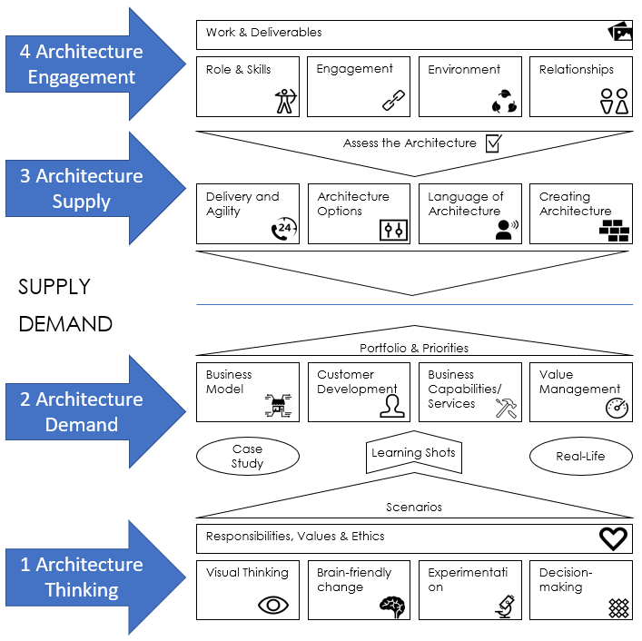

iasa-course-core-online-202004
# IASA Course: Core Online 202004

References:

Sharepoint: https://iasahome.sharepoint.com/sites/COREONLINE202004

Microsoft Teams: https://teams.microsoft.com/_?tenantId=bad69fe5-f001-4a91-9e67-9ceebf327367#/conversations/unknown?threadId=19:f9e8fc4a207048a6b770b9429fe702d9@thread.tacv2&ctx=channel

## Welcome to IASA CORE

COURSE ID: ***CORE 202004***

COURSE SHAREPOINT URL: https://iasahome.sharepoint.com/sites/COREONLINE202004

COURSE GROUP EMAIL: COREONLINE202004@iasaoffice.org

COURSE TEAMS: Teams

INSTRUCTOR: Rajiv Shah <rajivshah@iasaoffice.org>

## 000 INTRODUCTION

| Date | Module/filename | Topics | Short date |
| -- | -- | -- | -- |
| Monday, April 27, 2020 | Course introduction | Introduction to ITABoK, Course Schedule Review, Confirmation of course logistics etc. | 4/27 |
| Wednesday, April 29, 2020 | Course introduction | Student Introductions, Challenges, Iasa Proposition | 4/29 |
| Monday, May 4, 2020 |	Course introduction | What is architecture, Capability Pillars	| 5/4 |

## 100 MODULE 01: Architecture Thinking

See [README.md](./100/README.md)

| Date | Module/filename | Topics | Short date |
| -- | -- | -- | -- |
| Wednesday, May 6, 2020 | MODULE 01: Architecture Thinking | Visual Thinking |	5/6 |
| Monday, May 11, 2020 | MODULE 01: Architecture Thinking | Brain-friendly change | 5/11 |
| Wednesday, May 13, 2020| MODULE 01: Architecture Thinking | Experimentation, Decision-making | 5/13 |

## 200 MODULE 02: Architecture Engagement

See [README.md](./200/README.md)

| Date | Module/filename | Topics | Short date |
| -- | -- | -- | -- |
| Monday, May 18, 2020 | MODULE 02: Architecture Engagement | Role & Skills, Engagement | 5/18 |
| Wednesday, May 20, 2020 | MODULE 02: Architecture Engagement | Environment, Relationships, Work & Deliverables | 5/20 |

## 300 MODULE 03: Architecture Demand

See [README.md](./300/README.md)

| Date | Module/filename | Topics | Short date |
| -- | -- | -- | -- |
| Monday, May 25, 2020 | MODULE 03: Architecture Demand | Business Model, Customer Development | 5/25 |
| Wednesday, May 27, 2020 | MODULE 03: Architecture Demand | Business Capabilities, Value Management |	5/27 |
| Monday, June 1, 2020 | MODULE 03: Architecture Demand	| Portfolio & Priorities | 6/1 |

## 400 MODULE 04: Architecture Supply

See [README.md](./400/README.md)

| Date | Module/filename | Topics | Short date |
| -- | -- | -- | -- |
| Wednesday, June 3, 2020 | MODULE 04: Architecture Supply | Service Thinking,	Architecture Options | 6/3 |
| Monday, June 8, 2020 | MODULE 04: Architecture Supply	| Language of Architecture, Creating Architecture, Assess the Architecture | 6/8|

## 500 MODULE 05: Architecture Practice

See [README.md](./500/README.md)

| Date | Module/filename | Topics | Short date |
| -- | -- | -- | -- |
| Wednesday, June 10, 2020 | MODULE 05: Architecture Practice |	Change Happens, Skills Assessment | 6/10 |
| Monday, June 15, 2020 | MODULE 05: Architecture Practice | Culture Hacking, Maturity Assessment, Engagement Model | 6/15 |

## 600 Summary

See [README.md](./600/README.md)

| Date | Module/filename | Topics | Short date |
| -- | -- | -- | -- |
| Wednesday, June 17, 2020 | Course Summary | Exam prep and course Q&A | 6/17 |
					
